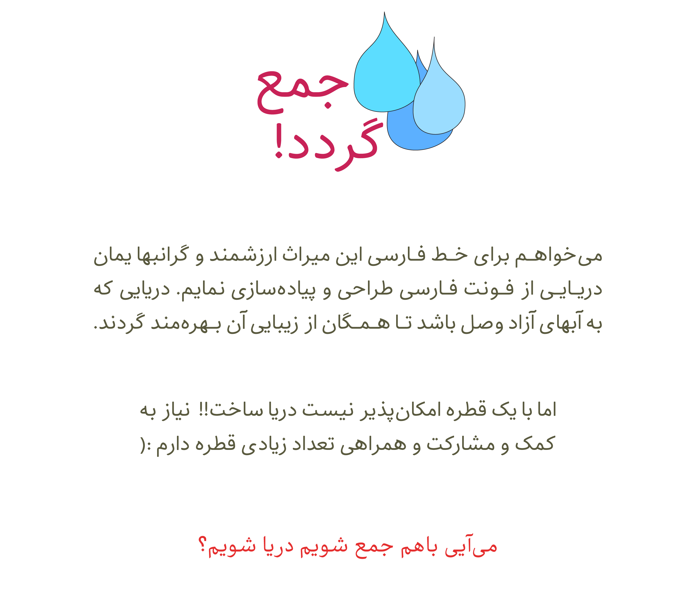
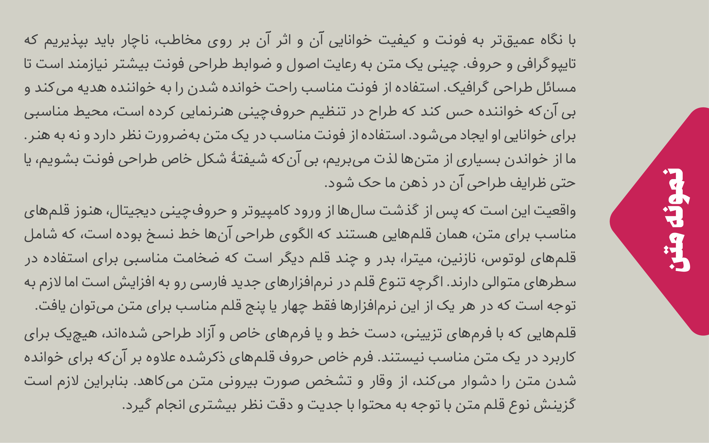

# About - درباره

- Name : Behdad 
- Descrption :Behdad is a Persian/Arabic font. This font is a gift to Behdad Esfahbod
- Designer : [Mohammad Saleh Souzanchi](http://github.com/zoghal)
- Development : [Mohammad Saleh Souzanchi](http://github.com/zoghal)
- Style : Monoline
- Usage : Print & Desktop Publishing, Web, Mobile.
- Version : 0.0.3
- Download : [here](https://github.com/font-store/font-behdad/releases/latest)

<ul  dir="rtl">

<li>نام : بهداد </li>
<li>توضیحات : بهداد یک فونت فارسی/عربی  هست و یک هدیه ویژه برای بهداد اسفهبد</li>
<li>طراح تایپ‌فیس : <a href="http://github.com/zoghal">محمد صالح سوزنچی</a></li>
<li>توسعه‌دهنده : <a href="http://github.com/zoghal">محمد صالح سوزنچی</a></li>
<li>سبک : غیر تحصیلی - منولاین</li>
<li>کاربرد : چاپ و نشر رومیزی، وب، موبایل</li>
<li>ویرایش :  ۰.۰.۳</li>
<li>دانلود : <a href="https://github.com/font-store/font-behdad/releases/latest">کلیک کنید</a></li>

</ul>

#  Demo & Tests - دمو و تست‌ها

- Tecnical Tester : [here](http://font-store.github.io/font-Behdad/online/)
- Survey 1 : [here](http://font-store.github.io/font-Behdad/tests/)
- Typography example : [here](http://font-store.github.io/font-behdad/typography-persian.htm)
- Paper demo : [here](http://font-store.github.io/font-behdad/paper-persian.htm)

<ul  dir="rtl">
<li>حرفه‌ای تست کنید : <a href="http://font-store.github.io/font-Behdad/online/">کلیک کنید</a></li>
<li>نظرخواهی : <a href="http://font-store.github.io/font-Behdad/tests/">کلیک کنید</a></li>
<li>نمونه تایپوگرافی : <a href="http://font-store.github.io/font-behdad/typography-persian.htm">کلیک کنید</a></li>
<li>مقاله نمایشی : <a href="http://font-store.github.io/font-behdad/paper-persian.htm">کلیک کنید</a></li>
</ul>

# Donation - حمایت مالی

## قطره‌هایی که بهداد رو دوست داشتند و به دریا پیوستند

total(rials) : ۰ تومان

total(dollar) : 0$

هیشکی دوستش نداشته تا الان :(

# Preview - تصاویر نمایشی

