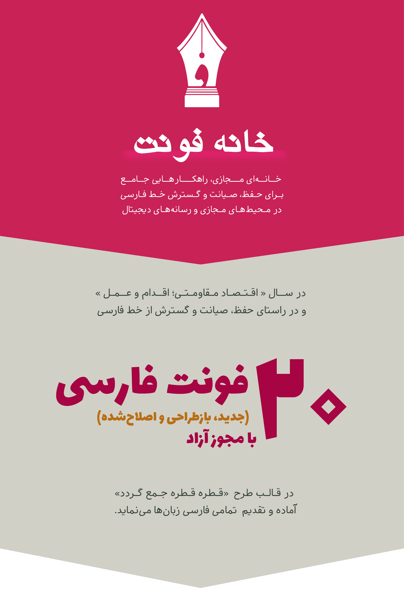
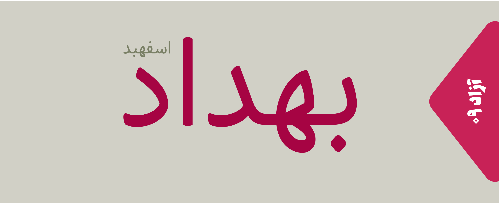
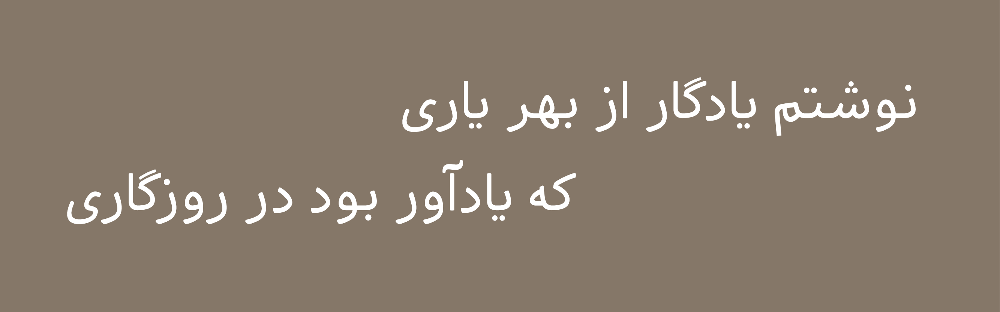
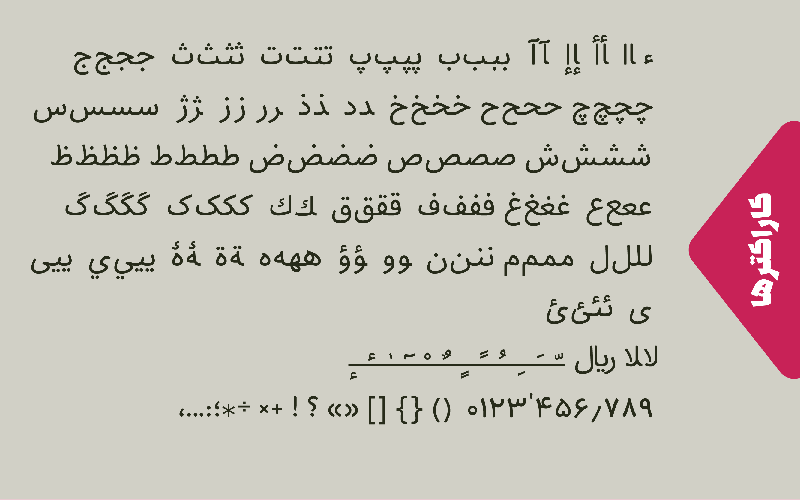

# About

- Name : Behdad 
- Descrption :Behdad is a Persian/Arabic font. This font is a gift to Behdad Esfahbod
- Designer : [Mohammad Saleh Souzanchi](http://github.com/zoghal)
- Development : [Mohammad Saleh Souzanchi](http://github.com/zoghal)
- Style : Monoline
- Version : 0.0.2
- Download : [here]()

#  Demo & Tests

- Tecnical Test :
- Survey 1 : [here](http://font-store.github.io/font-behdad/)

# Preview

